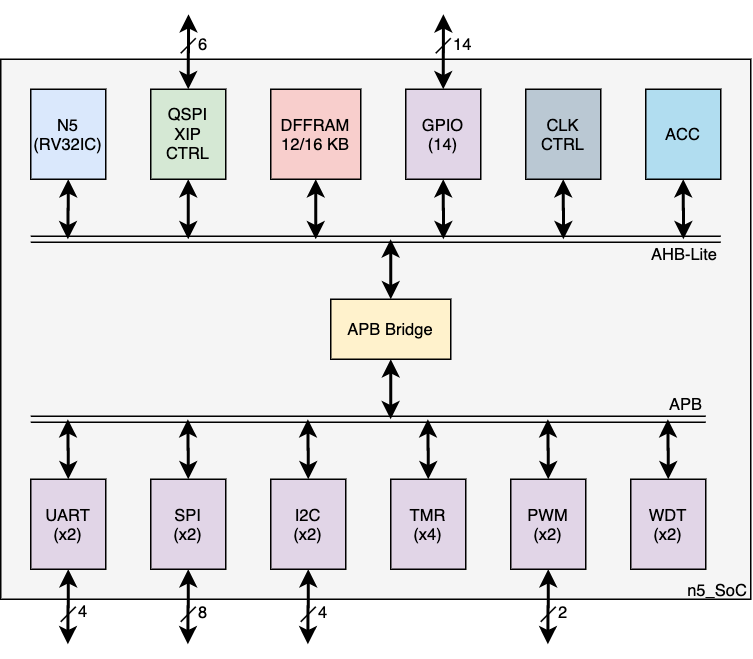
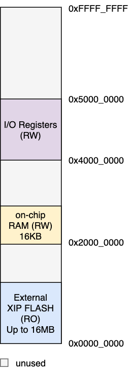

# N5_SoC
[NFive32](https://github.com/shalan/NFive32)-Based SoC to validate several open-source projects and IPs. This includes:
- [NfiVe32](https://github.com/shalan/NFive32) CPU Core
- [ADPoR](https://github.com/shalan/ADPoR): All Digital Power on Reset IP
- [QSPI_XIP_CTRL_DMC](https://github.com/shalan/QSPI_XIP_CTRL_DMC): Quad I/O SPI XIP Flash Controller w/ prefatch cache IP.
- [SoCGen](https://github.com/shalan/https://github.com/habibagamal/SoC_Automation): SoC generator.
- [DFFRAM RegF](https://github.com/shalan/DFFRAM): Hand-crafted Register File optmized for area and power (SKY130A).
- Clock Management IP.

## Architecure

## The Memory Map

## Peripherals
|Peripheral|Bus|Base Address|IRQ #|MPRJ I/O Pins|
|----------|---|------------|--------|-----|
|GPIO (14)|AHB|0x48000000|0-15|0-13|
|UART0|APB|0x40000000|16|20-21|
|UART1|APB|0x40100000|17|22-23|
|SPI0|APB|0x40200000|18|24-27|
|SPI1|APB|0x40300000|19|28-31|
|I2C0|APB|0x40400000|20|32-33|
|I2C1|APB|0x40500000|21|34-35|
|PWM0|APB|0x40600000|n/a|26|
|PWM1|APB|0x40700000|n/a|37|
|TMR0|APB|0x40800000|22|n/a|
|TMR1|APB|0x40900000|23|n/a|
|TMR2|APB|0x40A00000|24|n/a|
|TMR3|APB|0x40B00000|25|n/a|
|WDT0|APB|0x40C00000|26|n/a|
|WDT1|APB|0x40D00000|27|n/a|

## How to use
- To simulate: type `make` inside the `dv` folder. For a faster simulation use `make fast_sim` instead which disables the usage of the hand-crafted modules.
-  To synthesize with the hand-crafted modules, define the following macros:
   -  `HC_CACHE`
   -  `USE_RF_MODULE`
   -  `USE_RF_HC`

